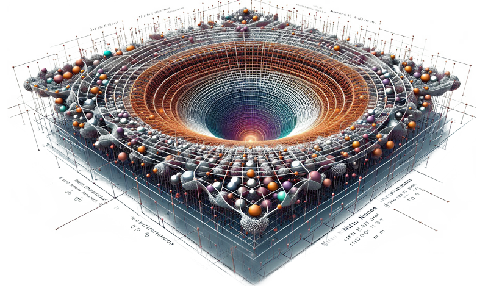

# DUT
Discrete Unification Theory

# Repository Contents
- [DUTv20.0_English.pdf](./DUT_Sol0FinalENGv2.0.pdf): The main document outlining the Discrete Unification Theory.
- [TUDv20.0_Spanish.pdf](./DUT_Sol0FinalSPv2.0.pdf): Spanish version of the theory.
  

  

# Discrete Unification Theory (DUT)

The **Discrete Unification Theory (DUT)** proposes a novel theoretical framework designed to address fundamental issues in physics. By integrating concepts from General Relativity and Quantum Mechanics into a dynamic non-commutative geometric structure, the theory aims to resolve long-standing inconsistencies and provide new insights into the nature of the universe.

---

## Overview

The DUT focuses on unifying existing physical frameworks while tackling cosmological challenges such as dark matter, dark energy, and the cosmological constant. The theory is built upon the principles of **Dynamic Non-Commutative Geometry (DNCG)**, redefining spacetime at quantum levels and offering solutions that extend beyond the limitations of traditional models.

### Objectives:
1. **Theoretical Unification**:
   - Develop a cohesive model that reconciles the mathematical structures of General Relativity and Quantum Mechanics.
   
2. **Cosmological Understanding**:
   - Provide dynamic scalar fields to describe dark matter and dark energy.
   
3. **Fundamental Constants**:
   - Propose mechanisms to stabilize the cosmological constant and resolve the quantum hierarchy problem.

---

## Key Innovations

1. **Non-Commutative Spacetime**:
   - Introduces uncertainty in the structure of spacetime by treating coordinates as non-commutative operators, leading to a more refined understanding of quantum phenomena.

2. **Emergent Gravity**:
   - Reframes gravitational effects as emergent properties derived from algebraic and geometric relationships rather than fundamental fields.

3. **Experimental Predictions**:
   - Offers testable hypotheses that can be evaluated through observational data and high-energy physics experiments.

4. **Cosmological Insights**:
   - Provides new frameworks to analyze and predict the behavior of dark matter, dark energy, and other cosmological phenomena.

---

## Academic Contribution

The Discrete Unification Theory addresses critical gaps in modern physics by proposing a unified framework that is both mathematically rigorous and experimentally testable. Its implications extend to various domains, including particle physics, cosmology, and theoretical physics, offering a comprehensive approach to understanding the universe.

This repository serves as a platform to share the theoretical foundation of DUT, inviting constructive feedback, academic discussion, and collaborative exploration. Researchers and scholars are encouraged to engage with the material, provide commentary, and build upon the concepts introduced herein.

---

## Repository Contents

- [TUDv17.9_Ingles.pdf](./TUDv17.9_Ingles.pdf): The main document outlining the Discrete Unification Theory.
- [TUDv17.8_Spanish.pdf](./TUDv17.8_Spanish.pdf): Spanish version of the theory.
---

## Contribution Opportunities

Scholars, researchers, and enthusiasts are invited to engage with this project. Contributions may include:

- Suggestions for refinement or expansion of the theoretical framework.
- Critical evaluations of the proposed mechanisms and predictions.
- Experimental or observational insights to strengthen the theory's testability.
- Suggestions for refining or expanding the theoretical framework.
- Critical evaluations of the proposed mechanisms and predictions.
- Experimental or observational ideas to strengthen the testability of the theory.
- Development of simulations to test the theoretical principles of DUT.
- Collaborative workgroups for exploring new perspectives on quantum or cosmological phenomena.
- Co-authoring publications to present related findings and advancements.
- Exploration of technological applications inspired by DUT concepts, such as advancements in quantum technologies or high-performance computing.
- Creation of educational and outreach materials to engage students and the broader scientific community.

We welcome collaboration from diverse fields to further develop and validate the theory.
---

## Contact Information

- **Author**: J.A.Grau  
- **Email**: [jgrau@live.com](mailto:jgrau@live.com)  

For academic inquiries, discussions, or collaborative opportunities, please reach out via email.
## "Keywords"
## Keywords / Palabras clave
- Discrete Unification Theory
- General Relativity
- Quantum Mechanics
- Non-Commutative Geometry
- Dark Matter
- Dark Energy
- Cosmological Constant
- Quantum Gravity
- Theoretical Physics
- Particle Physics
- Scalar Fields
- Higgs Boson
- Emergent Gravity
- Astrophysics
- Mathematical Frameworks
- Quantum Phenomena
- Cosmology
- Quantum Hierarchy Problem
- Experimental Predictions
- Unified Framework

- Teoría de la Unificación Discreta
- Relatividad General
- Mecánica Cuántica
- Geometría No Conmutativa
- Materia Oscura
- Energía Oscura
- Constante Cosmológica
- Gravedad Cuántica
- Física Teórica
- Física de Partículas
- Campos Escalares
- Bosón de Higgs
- Gravedad Emergente
- Astrofísica
- Marcos Matemáticos
- Fenómenos Cuánticos
- Cosmología
- Problema de Jerarquía Cuántica
- Predicciones Experimentales
- Marco Unificado

